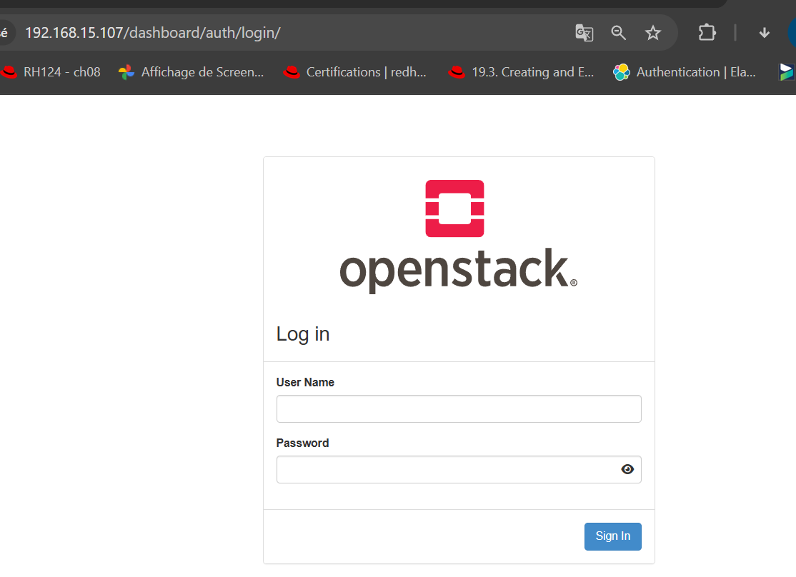
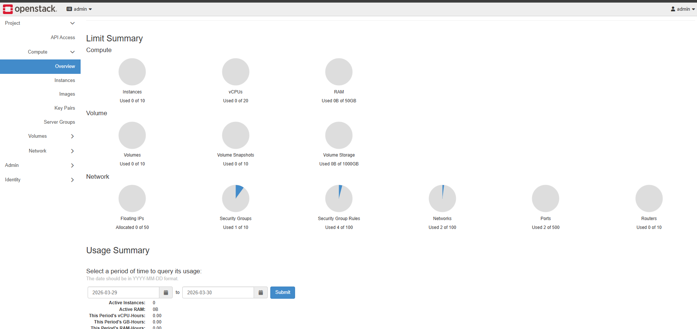
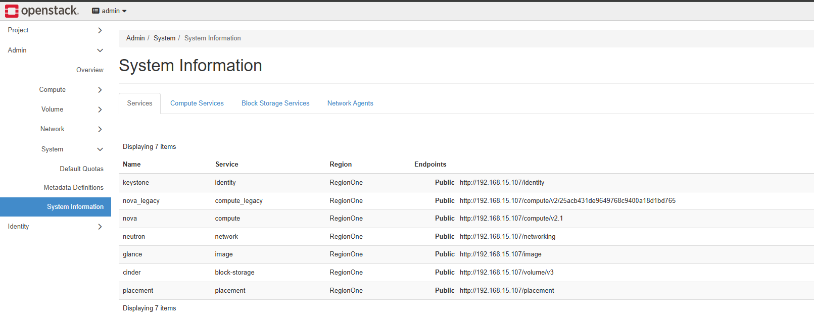

# Installation Openstack avec la methode Devstack
1. Prerequis:
- Ubuntu 24.04 propre (VM ou machine physique)
- Minimum recommandé :
    - 4 vCPU
    - 8 Go RAM (16 Go idéal)
    - 20–40 Go disque
- Accès internet

La première étape consiste à installer les prérequis nécessaires au bon fonctionnement de DevStack.
```bash
sudo apt update
sudo apt install snapd
sudo snap install hello-world
hello-world
sudo apt install git-all
git --version
```

2. Préparation de l'environment 
Nous allons maintenant préparer et configurer l’environnement système pour installer  DevStack

```bash
sudo useradd -s /bin/bash -d /opt/stack -m stack
sudo chmod +x /opt/stack
echo "stack ALL=(ALL) NOPASSWD: ALL" | sudo tee /etc/sudoers.d/stack
sudo -u stack -i
git clone https://opendev.org/openstack/devstack
cd devstack/
nano local.conf
```
Copiez et utilisez le contenu suivant dans le fichier local.conf

```yaml
[[local|localrc]]

ADMIN_PASSWORD=<definir-le-mot-de-passe>

DATABASE_PASSWORD=$ADMIN_PASSWORD

RABBIT_PASSWORD=$ADMIN_PASSWORD

SERVICE_PASSWORD=$ADMIN_PASSWORD
```
3. Installation 
Exécutez la commande suivante pour lancer l’installation.

```bash
./stack.sh
```

NB : En cas d’erreur durant l’installation, identifiez et installez les dépendances manquantes, puis relancez le script

4. Vérification de la version installer 
Exécutez la commande suivante pour vérifier la version installée.

```bash
openstack --version
```
Une fois l’installation terminée, les informations de connexion et les identifiants nécessaires sont fournis.



